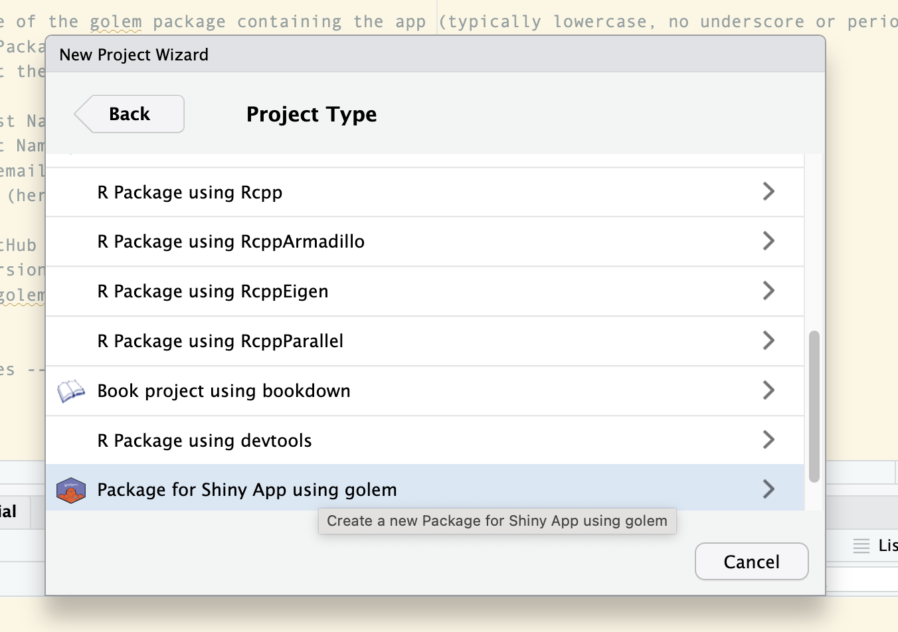

<!-- badges: start -->

[](https://lifecycle.r-lib.org/articles/stages.html#experimental)
<!-- badges: end -->

<!-- README.md is generated from README.Rmd. Please edit that file -->

# `{GolemTestApp}`

This is a test app built using the `{golem}` package to demonstrate how
to set-up a golem package, deployed on the CBR server, with the option
to update data using a CRON job. It is by no means the only method, but
is one that I have found to work so far.

Golem is an R package built to be a helper in producing production-grade
Shiny applications. It provides a framework and helper functions for
building Shiny applications that are modular, maintainable, and
scalable. Because of that there is more that goes into the set-up of a
golem package than a standard Shiny app. This app is designed to be a
simple example of how to structure a golem package, including how to
update data via a CRON job.

Below are existing CBR shiny apps using a golem framework:

- [Hydro2HydroLCM real-time
  version](https://tigger.cbr.washington.edu/shiny/Hydro2HydroLCM/) this
  version requires being signed into Big-IP Edge Client or see,
- [Hydro2HydroLCM static
  version](https://cbr.washington.edu/shiny/Hydro2HydroLCM/)
- [HydroSurvDOYTEMP](https://cbr.washington.edu/shiny/HydroSurvDOYTEMP/)
- [SARforecastDLM](https://cbr.washington.edu/shiny/SARforecastDLM/)

All code supporting each app, can be found in repositories here:
<https://github.com/Columbia-Basin-Research-CBR>. (Must have access to
CBR-organization to view)

## To view this app:

### Installation

If you’ve cloned the repo into Rstudio, you skip to run the code
section.

Otherwise, you can install the development version of `{GolemTestApp}`
by downloading the bundled package:

[Download
GolemTestApp_0.0.0.9000.tar.gz](inst/app/www/GolemTestApp_0.0.0.9000.tar.gz)

``` r
# Once downloaded, you can install the package using the following code:
library(here)
library(remotes)
remotes::install_local(here::here("GolemTestApp_0.0.0.9000.tar.gz")) #update path depending on where the package is saved

#load the test app
library(GolemTestApp)
```

### Run

You can launch the application by running:

``` r
GolemTestApp::run_app()
```

Alternatively, the app can be run by accessing the dev/run_dev.R file.

### Test updated data

If you’d like to update via cron job, direct the cron job to the
`data-raw/` folder where the file is saved and run code. The file should
save & overwrite the existing data in the `inst/app/data/` folder. If you’d like
to run without a cron job, run code below to update data and then
run_app() again.

``` r
source(here::here("data-raw/utils_update_data_via_cron_job.R")) 
GolemTestApp::run_app()
```

Alternatively, if you do not want to set-up cron job and not worried
about updating data daily, the `utils_update_data_via_cron_job.R` can be
placed within the R/ folder. Any file within that folder is prompted to
run upon each build of the app. This behavior also means it’s best not
to keep any files that are not needed to run in the app within that
folder to avoid unintended errors. If you decide to move the file to the
R/ folder, you should see the console output denoting the file has been
updated and saved during each build:

    > golem::document_and_reload()
    ℹ Loading GolemTestApp
    ✔ Saving "fake_data_updated_via_cron_job" to
      "data/fake_data_updated_via_cron_job.rda".
    ☐ Document your data (see <https://r-pkgs.org/data.html>).
    ℹ Loading GolemTestApp
    ✔ Saving "fake_data_updated_via_cron_job" to
      "data/fake_data_updated_via_cron_job.rda".
    ☐ Document your data (see <https://r-pkgs.org/data.html>).

## To set-up your own golem package:

Here is a brief starter guide for setting up a golem package hosted on
CBR server & updating with real-time data generated via a CRON job.

Most information and steps, including file structure for setting up a
golem package can be found in the [Engineering Production-Grade Shiny
Apps by Colin Fay, Sébastien Rochette, Vincent Guyader and Cervan
Girard](https://engineering-shiny.org/index.html). This is a brief
overview of the steps I used to get started with a {Golem} package,
including some tips for setting up a CRON job to update real-time data
on the CBR servers.

### Setting it up

- To set-up an app in R, follow [Chapter 8. Setting up for Success with
  {golem}](https://engineering-shiny.org/setting-up-for-success.html). A
  few helpful thoughts:

  - Select name carefully, the package can be renamed later, but easier
    to do it right the first time.

  - When setting up via New Project Wizard, scroll and should see golem
    option in Project Type (see Fig 1). You might get a warning that app
    is nested in project that requires confirmation of next steps. As
    long as it’s a new project, that’s okay. Select 1 and continue with
    build.

<div class="figure" style="text-align: center">


<p class="caption">
Fig 1. Select golem in New Project Wizard
</p>

</div>

- Once set-up, begin to add components to build the shiny app following
  the recommendations, naming, and organization outlined in Chapter 8

### Adding packages

- Any packages that you want to include (such as `shinydashboardPlus` or
  `shinydashboard`) can be added to the package description and will be
  included in any future build, or prompt to install if not already
  installed. Golem does require package function calls for successful
  deployment (i.e., dplyr::filter() instead of just calling filter for
  anything outside baseR or shiny functions). Also, Golem, or any
  package build, recommends avoiding installing tidyverse and instead
  calling specific packages within the larger package such as calling
  tidyr, dplyr, or lubridate individually. This might seem silly but is
  important for keeping production package ready long-term. If using
  specific shortcut for tidyverse such as `%>%` , can add to description
  with `use_this::use_pipe()'`, or just use baseR and avoid the issue
  altogether.

### If using cron job to update data, steps include:

1. Create a file in the `data-raw/` folder to point the cron job to update. Files within data-raw/ are included in the bundled final package, but are not run each time the app deploys and can be set to run based on need using a cron job. This file should save & overwrite the existing data in the `inst/app/data/` folder. 

2.  Golem & Shiny like to cache data, to override and force shiny to update with new data on the CBR server, a method that can be used is `shiny::reactiveFileReader()` which can be set at different time increments to search the designated folder location for changes in the file. I've set it so that the file is loaded into the environment to then be used. It is set to check every minute for test purposes but can be set to much longer depending on when CRON job is set to update data. Functions below can be found within the `app_server.R` file and then called as a reactive in any module where the data is being used, such as the `mod_main.R` in this example. *Note, this is a method that is currently being deployed in the [Hydro2HydroLCM ShinyApp](https://tigger.cbr.washington.edu/shiny/Hydro2HydroLCM/) and has proven to work, but there are likely other, possibly more streamlined methods to achieve the same result. The issue we were running into is that while the cron job updated the file and rewrote to the data/ folder as expected, it did not necessarily mean that app hosted on the CBR server would start using the new data file. This method, forces the golem shiny package to check for any updated data, and if any changes have occured, to reload the data into the enviroment for shiny to use. We (Susannah) has also included the restart.txt within the cron job to force a new session, but further testing is required to know if that is necessary with this method. It does not seem to hurt.*

``` r

        app_server <- function(input, output, session) {
            # Your application server logic
            data_path <- system.file("app/data", "fake_data_updated_via_cron_job.rda", package = "GolemTestApp") #inst/ is a higher level folder and should be dropped from path
          
            fake_data_updated_via_cron_job <- reactiveFileReader(
              intervalMillis = 1000*60,  # check every minute
              session = session,
              filePath = data_path,
              readFunc = function(path) {
                current_time <- Sys.time()
                message("[fake_data_updated_via_cron_job.rda] File checked at: ", format(current_time, "%Y-%m-%d %H:%M:%S"))
          
                e <- new.env()
                load(path, envir = e)
                e$fake_data_updated_via_cron_job  # actual loaded object returned
              }
            )
          
            observe({
              fake_data_updated_via_cron_job()
          
              #add module for main server code
              mod_main_server("mod_main_1", add_reactive_data = fake_data_updated_via_cron_job())
              })
          }

        #' main UI Function
        #'
        #' @description A shiny Module.
        #'
        #' @param id,input,output,session Internal parameters for {shiny}.
        #'
        #' @noRd
        #'
        #' @importFrom shiny NS tagList
        mod_main_ui <- function(id) {
          ns <- NS(id)
          tagList(
            h3("Main Module UI"),
            plotOutput(ns("main_plot_reactive")),
          )
        }

        #' main Server Functions
        #'
        #' @noRd
        mod_main_server <- function(id, add_reactive_data){
          moduleServer(id, function(input, output, session){
            ns <- session$ns

            #Uses reactive file reader data generated in app_server.R
            output$main_plot_reactive <- renderPlot({
              x <- add_reactive_data$x
              y <- add_reactive_data$y
              date <- unique(add_reactive_data$date)
              # Example plot code
              plot(x,y, main = paste("Simulated data\nlast updated:", date), xlab = "x", ylab = "y")
            })

          })
        }

        ## To be copied in the UI
        # mod_main_ui("main_1")

        ## To be copied in the server
        # mod_main_server("main_1")
```
